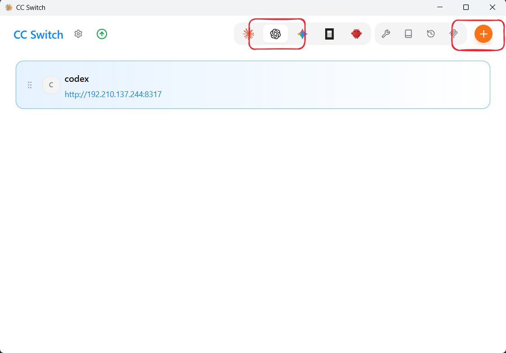
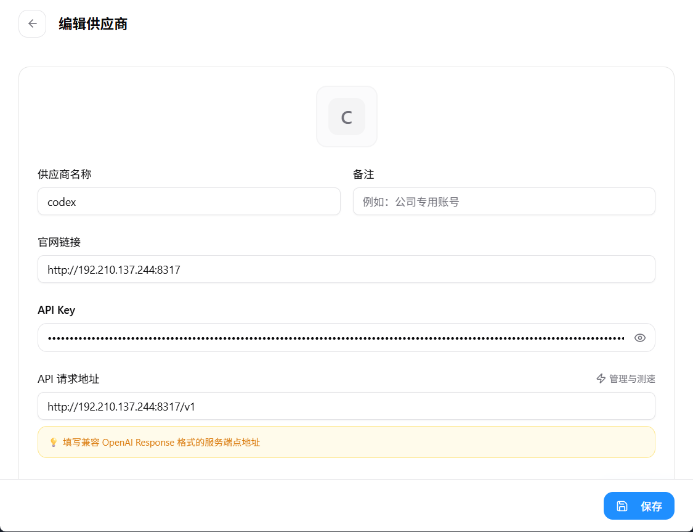
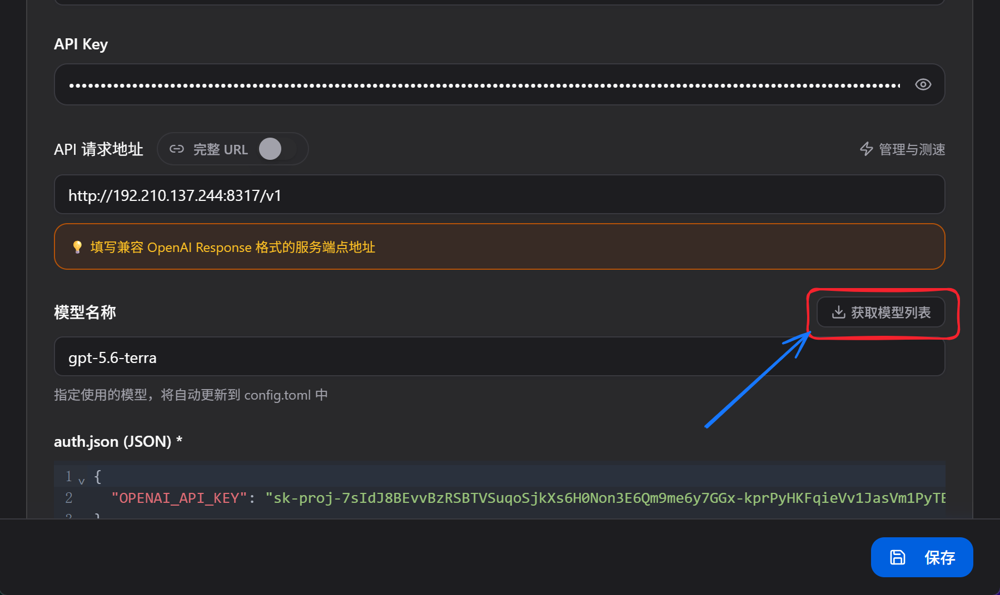
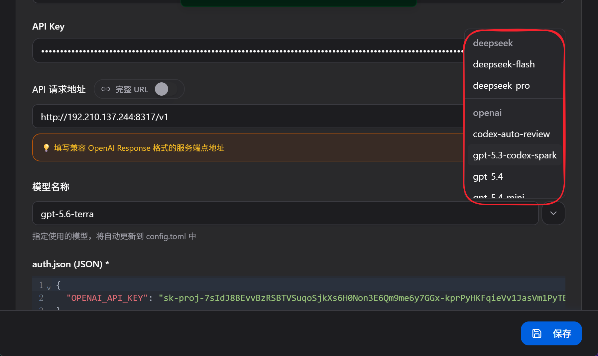
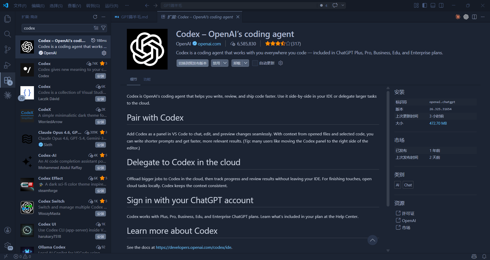
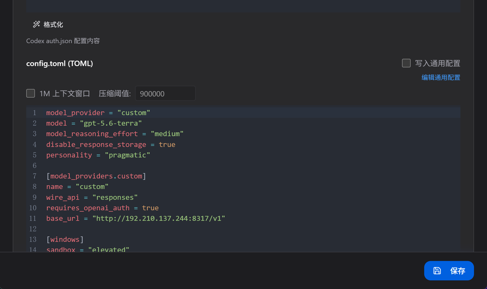
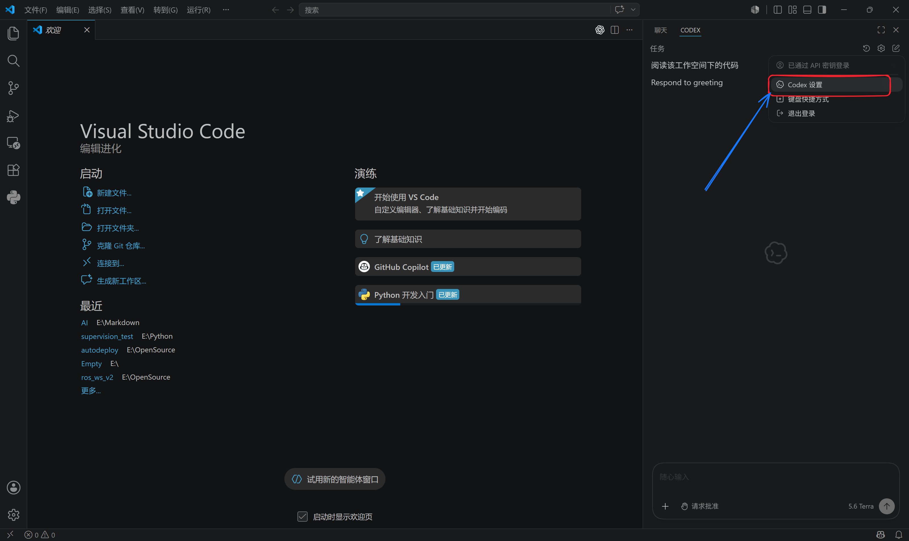
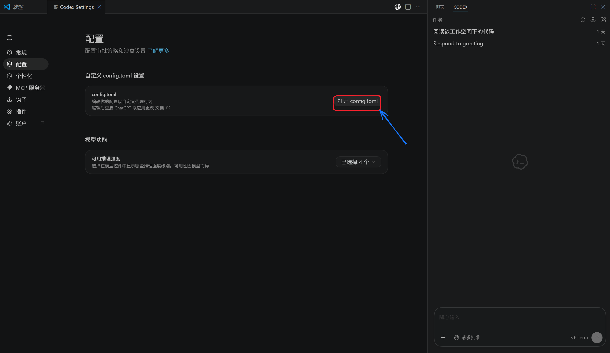
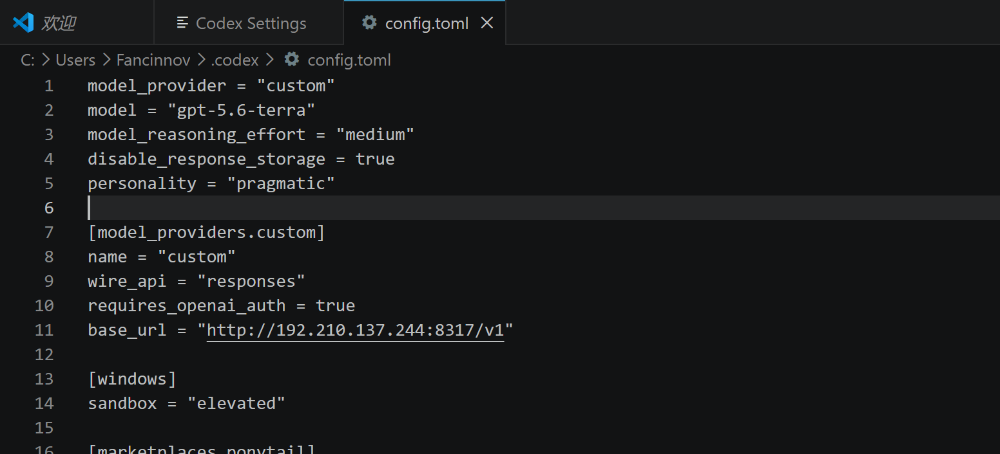

# Life is short, I use AI.

## ccswitch安装以及配置

ccswitch的github地址: [https://github.com/farion1231/cc-switch/releases](https://github.com/farion1231/cc-switch/releases)

用windows的话就选择CC-Switch-xxx-Windows.msi(x为版本号)即可(建议使用cc-switch v3.13.0)

### 导入配置

安装好之后导入openai的配置，刚开始没有需要新建

供应商选择自定义，官网链接，API-KEYS和API请求地址如下填写

官网链接

~~~
http://192.210.137.244:8317
~~~

API-KEYS

~~~
你的密钥
~~~

API请求地址

~~~
http://192.210.137.244:8317/v1
~~~

点击`获取模型列表`

可以看到这么多模型你都可以使用，这里建议日常办公使用`gpt-5.6-terra`

点击`保存`之后就可以在vscode中使用了，这时候我们的vscode的codex插件会显示模型`自定义`是因为gpt5.6在还没有更新端，但是不会妨碍我们使用。

## 在vscode中使用codex/GPT

打开vscode搜索codex插件并安装

### 底层配置文件

我们使用vscode的codex插件，使用ccswitch其实使用的是同一套配置文件，就是这个`config.toml`，该文件里面的`model`参数直接决定了我们使用什么模型，所以如果你不确定模型更换是否生效，可以直接查看该配置文件。

---
CC-switch

---
VScode

